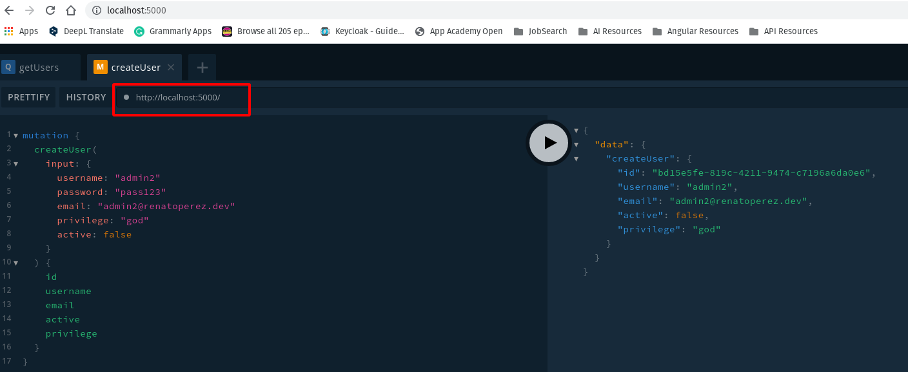
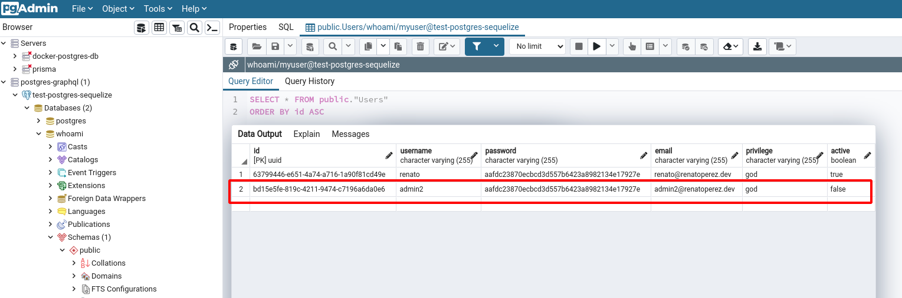

## Apollo Server from Scratch using Serialize and PostgreSQL

Backend entry point is `src/index.ts`

```typescript
// schema
const schema = makeExecutableSchema({ typeDefs, resolvers })

// Apollo Server

const apolloServer = new ApolloServer({ schema, context: { models } })

const alter = true
const force = false

models.sequelize.sync({ alter, force }).then(() => {
  apolloServer.listen($server.port).then(({ url }) => {
    console.log(`Running on ${url}`)
  })
})
```

there we defined `schema` that is essentially GraphQL type definitions  
and resolvers
`Apollo Severs` needs `schema` and `context` the sort of global parameters that will  
be available for all `resolvers`

then the `sequelize` model start the database

### Backend functionality

This backend is pretty simple the functionality can be summarized in one file  
`src/graphql/types/User.graphql` that is the type definitions for Queries and Mutations

```graphql
type Query {
  getUsers: [User!]
  getUserData(at: String!): User!
}

type Mutation {
  createUser(input: CreateUserInput): User!
  login(input: LoginInput): AuthPayload!
}
```

What we can read is:

- We can **read**(Query): getUsers -> list of users and getUserData -> particular user data
- We can **create**(Mutation): createUser -> create a new user
- We can **verify** and **create** a token for an **authenticated** user: login

having that we can run our server in dev:

npm script: `npm run dev`



